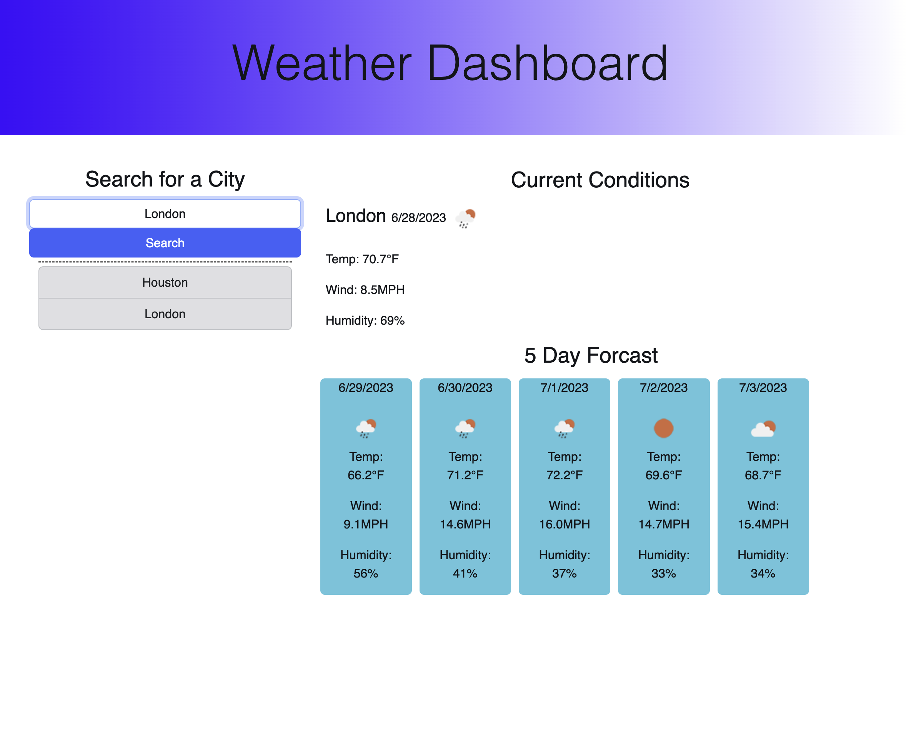

# paul-cox-weather-dashboard

## Description

This project is weather dashboard application to display the current weather and 5 day forcast for a chosen city.  The user is able to input a city name and view the current weather and forcast.  The user's searches are saved in local storage and displayed under the search area. This history remains when the user navigates away from the page.  Duplicate entries are not stored in the past searches list and the city name is automatically capitalized. An error will alert the user if a bogus city name is entered. 

I learned a ton about using apis in this challenge.  Fetching info and distributing it around the dom upon request are a few of the skills I was able to practice.  I also discovered new javasript methods and functions that will be very usefull in the weeks to come.  The site also uses bootstrap which cut down on a lot of my normal CSS styling.

## Installation

the web address for this project is:

https://reflexson.github.io/paul-cox-weather-dashboard/

The reference code can be accessed here:

https://github.com/reflexson/paul-cox-weather-dashboard

## Usage

simply navigate to the website or source code to interact with this project.

Here is a pic that shows the functionality of the site

